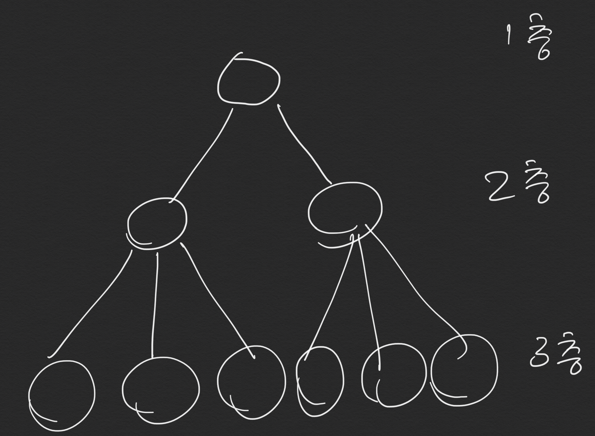

[출처](https://programmers.co.kr/learn/courses/30/lessons/43163)

## 문제 설명
두 개의 단어 begin, target과 단어의 집합 words가 있습니다. 아래와 같은 규칙을 이용하여 begin에서 target으로 변환하는 가장 짧은 변환 과정을 찾으려고 합니다.

1. 한 번에 한 개의 알파벳만 바꿀 수 있습니다.
2. words에 있는 단어로만 변환할 수 있습니다.

예를 들어 begin이 hit, target가 cog, words가 [hot,dot,dog,lot,log,cog]라면 hit -> hot -> dot -> dog -> cog와 같이 4단계를 거쳐 변환할 수 있습니다.

두 개의 단어 begin, target과 단어의 집합 words가 매개변수로 주어질 때, 최소 몇 단계의 과정을 거쳐 begin을 target으로 변환할 수 있는지 return 하도록 solution 함수를 작성해주세요.

## 제한사항
각 단어는 알파벳 소문자로만 이루어져 있습니다.
각 단어의 길이는 3 이상 10 이하이며 모든 단어의 길이는 같습니다.
words에는 3개 이상 50개 이하의 단어가 있으며 중복되는 단어는 없습니다.
begin과 target은 같지 않습니다.
변환할 수 없는 경우에는 0를 return 합니다.
## 입출력 예
|begin	|target	|words	|return|
|-|-|-|-|
|hit|	cog|	[hot, dot, dog, lot, log, cog]|	4
|hit|	cog	|[hot, dot, dog, lot, log]|	0
## 입출력 예 설명

예제 #1

문제에 나온 예와 같습니다.

예제 #2

target인 cog는 words 안에 없기 때문에 변환할 수 없습니다.


## 문제풀이 

얼핏보면 BFS 문제가 아닌 것 같지만, BFS를 응용한 방식으로 풀어야 하는 문제다. 

BFS는 하나의 층을 내려가면서 모든 노드를 탐색한다.



이 문제는 모든 경우의 수를 탐색하되 target 단어가 선택 되는 층이 언제인지를 구하라는 문제로 생각하고 풀 수 있다. 

```python
def solution(begin, target, words):
    q =[] 
    cnt = 1 # cnt가 층수
    for i in range(len(words)):
        if wordDiff(begin, words[i]):
            q.append(words[i])
            if words[i] == target:
                return cnt
    while cnt <= len(words) :
        cnt += 1 
        for _ in range(len(q)):
            v = q.pop(0)
            for i in range(len(words)):
                if wordDiff(v, words[i]):
                    q.append(words[i])
                    if words[i] == target:
                        return cnt
    return 0

def wordDiff (word1, word2):
    cnt = 0
    for i in range(len(word1)):
        if word1[i] != word2[i]:
            cnt += 1
            if cnt ==2:
                return False
    if cnt == 1:
        return True
    return False 
 


```