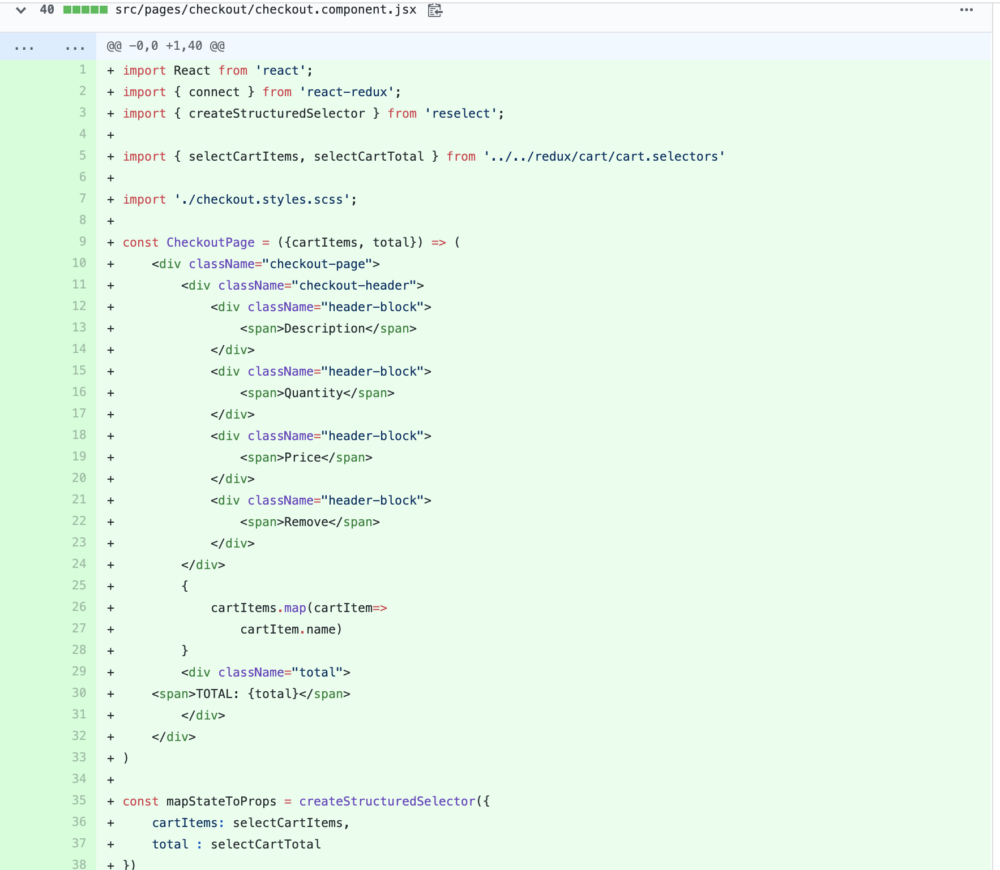
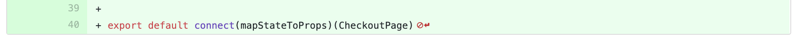
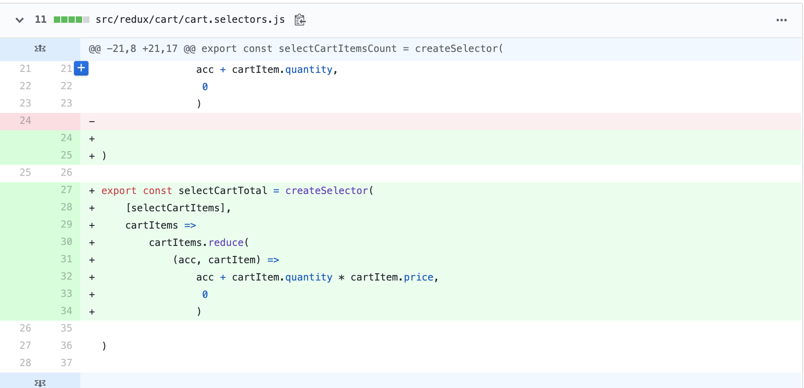
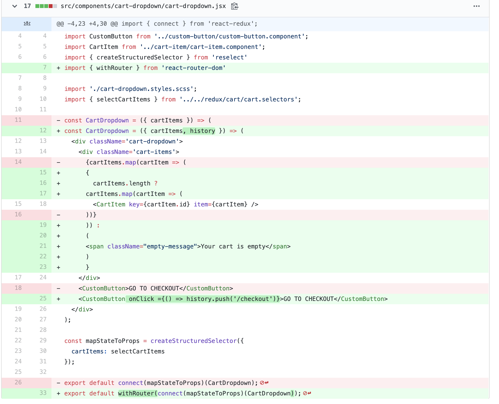

Daily Study Logging은 내가 매일 한 공부의 내용을 기록해 놓는 컨텐츠이다. 

현재 나는 리액트로 쇼핑몰을 만드는 연습을 유데미 강의를 들어가며 진행하고 있다. 매일매일 내가 커밋한 코드를 가지고 왜 그 부분에 그 코드가 추가 되었는지에 대한 설명을 적으며 나의 실력을 견고하게 만들고자 한다. 


[커밋 내용](https://github.com/Jesscha/react-shoppingmall/commit/1717f11f00324e8f5870eca8f28da04f55686a0c)

##### checkout 페이지를 새로 만들었다.



첫 블로깅 이니까 기본적인 사항도 한번씩 짚고 넘어가면 좋겠다는 생각에 위에서 import 한 모듈들이 어떤 것인지 한번씩 짚고 넘어가 보도록 하자 

- `import React from 'react';`는 리액트를 불러온다. 여기의 코드만을 살펴보면 `React`라는 것은 어디에서도 사용하지 않고 있지만, Babel이 이 JSX 코드를 컴파일 할때 React.createElement 메서드를 시용하기 때문에 React를 import 하는 것은 필수적인 일이다. 

- `import { connect } from 'react-redux';`는 리덕스에서 저장하고 있는 State를 해당 컴포넌트에 집어넣기 위해 사용된다. 맨 아랫줄의 `export default connect(mapStateToProps)(CheckoutPage) ` 처럼 사용되어 리덕스의 state를 컴포넌트가 가져다 쓸 수 있게 해 준다. 자세한 용법은 `mapStateToProps`를 다루며 더 알아보자


- `import { selectCartItems, selectCartTotal } from '../../redux/cart/cart.selectors'` 는 셀렉터를 불러오는 것이다. 셀렉터가 무엇이냐면, 리덕스의 state를 받아서 새로운 데이터를 반환하는 함수라고 생각하면 된다. 

- `import { createStructuredSelector } from 'reselect';`는 셀렉터를 효율적으로 사용하기 위한 메서드다. 일반 셀렉터가 왜 비효율 적일까? 일반적으로 셀렉터를 한 파일에 보관 하고 관리하는데, 이때 한 파일 내에 있는 셀렉터가 갱신되면 다른 셀렉터도 갱신된다고 한다. 필요하지 않은 많큼 많은 컴포넌트 렌더링이 발생하게 된다. 이럴 때 발생하는 비효율을 막아 주는 것이 reselect이다. 정확히 필요한 부분에서 만 업데이트를 가능하게 해 주는 기능을 한다고 한다. createStructuredSelector는 reslector를 더 편하게 쓰게 해주는 매서드 중하나다. 이걸 쓰면 뒤에 들어오는 셀렉터에 state를 인자로 넣어주지 않아도 된다.

- `import './checkout.styles.scss';` 는 스타일을 위해서 가져왔다.


이제 35번째 줄부터 작성된 코드를 살펴보자 

```javascript

const mapStateToProps = createStructuredSelector({
    cartItems: selectCartItems,
    total : selectCartTotal
})

```

`mapstateToProps`는 일반적으로 `connect`에 첫번째 인자로 들어가는 방식으로 사용된다. 여기서 해당 컴포넌트가 사용할 state를 지정해 준다. 

`createStructuredSelector`는 위에서 말한 것 처럼 셀렉터를 효율적으로 쓰기 위한 reselect의 메서드 중 하나다. 이 메서드에는 {state이름 : 셀렉터 } 형식의 인자가 들어간다. 해당 selector에 state를 집어 넣은 결과 값이 해당 컴포넌트에서 사용하는 state가 된다. 


그럼 위의 셀렉터가 어떤 역할을 하는지 살펴 보자 



`createSelector`는 reselect 에서 불러온 메서드다. 위에서 설명했던 것 처럼 불필요한 rerendering을 막는다. memoization을 통해 막는다고 하는데, 아직 완전히 이해하지는 못했다. 

무튼 용법은 코드에서 보는 것과 같다. 첫번째 인자로 배열안에 셀렉터를 넣어 준다. 여기에서 들어간 셀렉터는 아래와 같다. 


 ```javascript
 const selectCart = state => state.cart;

 export const selectCartItems = createSelector(
    [selectCart],
    cart => cart.cartItems
);
```
state에서 cart를 불러내는 slectCart에서 cartItems를 불러내는 selectCartItems를 가지고 reduce펑션을 이용하여 카트에 담긴 아이템과 가격을 곱한 값의 총합을 반환하는 것이다. 

이렇게 반환된 값은 해당 컴포넌트 안에서 total이라는 이름의 state로 이용된다. 


다음으로는 cartdropdown 컴포넌트에서 체크아웃 페이지로 이동하는 기능과, 비어있음을 표시하는 기능을 추가 했다. 




`import { withRouter } from 'react-router-dom'`는 해당 컴포넌트에서 history 객체를 사용할 수 있게 해주는 HOC이다. 원래는 Router로 전해 질때만 쓸 수 있는 객체인데, 마지막에 `export default withRouter(connect(mapStateToProps)(CartDropdown));`와 같이 사용하여 해당 컴포넌트 내부에서 history 객체를 사용할수 있게 한다.

이게 어디에 사용되냐면, 이용자를 다른 페이지로 유도하는데 사용된다. 
`<CustomButton onClick ={() => history.push('/checkout')}>GO TO CHECKOUT</CustomButton>` 이처럼 history.push를 이용하여 이용자를 체크아웃 페이지로 이동시킬 수 있다. 

15줄 부터 23줄은 아이템이 있는 경우와 없는 경우의 출력을 다르게 지정해 주고 있다. Items가 없으면, 즉 길이가 0이면 your cart is empty를 반환한다. 있으면, 카트에 아이템을 표시해 준다.


