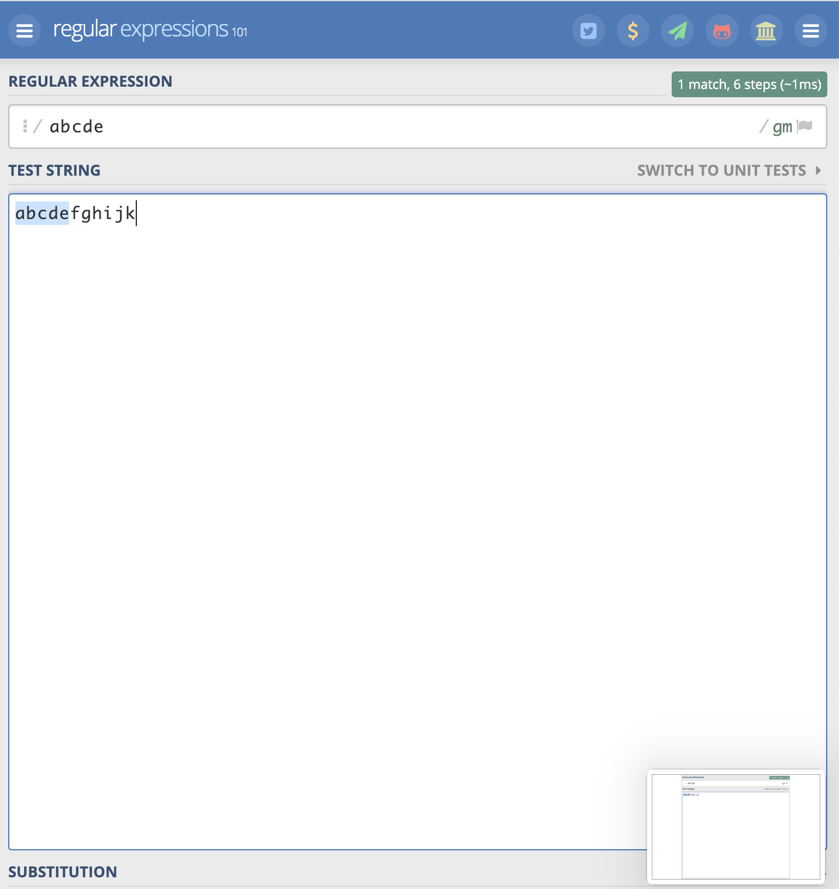
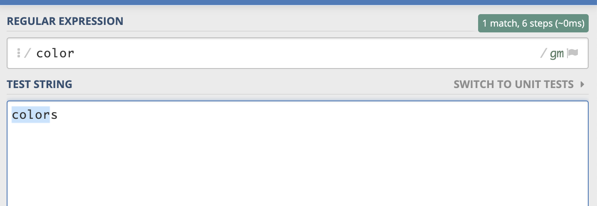
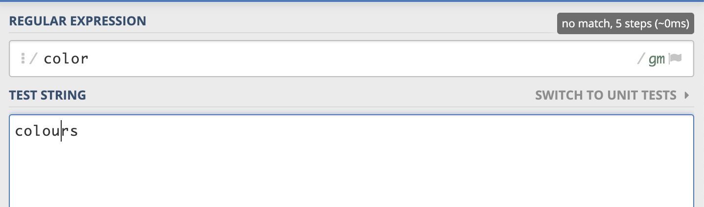
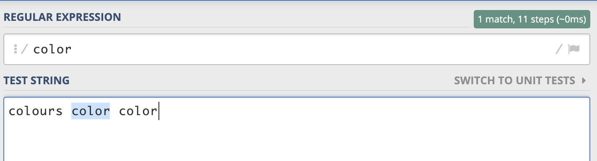
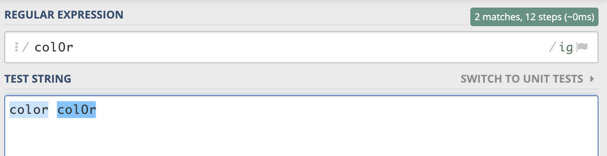
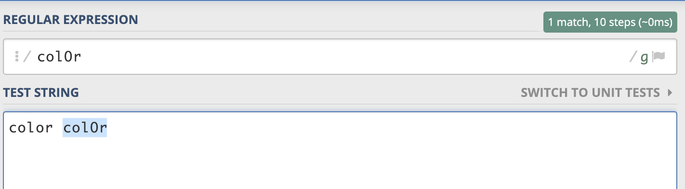

정규표현식을 제대로 공부해 본적이 없어서, 이게 나올 때 마다 귀찮고 신경이 쓰인다. 

이참에 정규표현식을 완전 정복해 버리기로 결심하고 udemy에서 강의를 하나 샀다. 

**기초 문법**

- "/" 와 "/" 사이에 정규 표현식을 집어 넣는다.

- Literal Character는 문자가 전부 일치 하는 것을 의미한다. 전부 일치하지 않으면 일치하지 않는다고 처리된다. 

- 모드는 정규 표현식이 끝나고 선언한다. 
    - Standard Mode: /regex/
    - Global Mode: /regex/g
    --> 여러개를 모두 인식, 안넣으면 처음 매치 하는 것만 인식
    
    
    - Single Line Mode: /regex/s
    - Case insensitive Mode : /regex/i
    --> 대소문자를 구분하지 않는다.
    
    
    - Milti Line Mode: /regex/m

**메타 문자**

우리가 일상적으로 쓰는 의미랑은 다르다. 아래와 같은 문자들을 쓴다.

*+-!=(){}[]^$|?:\ .

메타문자에 대해서는 다음 포스팅에서 이어 가겠다.