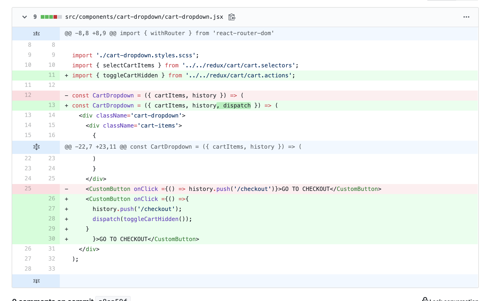

[커밋 내용](https://github.com/Jesscha/react-shoppingmall/commit/a8ea59fdac880bec953d3475ea7c40298f7ba8fa)





기존의 프로젝트는 cartDropdown 컴포넌트에서 CheckOut Page로 이동을 시키면, cartDrodown 컴포넌트가 여전히 보이는 문제가 있었다. 

cartDropdown의 display 상태를 정하는 방법이 카트 이미지를 클릭하는 것 이었기 때문이다. 이미지를 클릭하면 toggleCartHidden이라는 함수가 트리거 된다. 이 함수가 뭘 하냐면 리덕스에서 hidden 이라는 state를 false이면 true로, true이면 false로 바꾸어 주는 역할을 하는 함수다. 

그냥 onClick으로 hidden을 추가하고 빼면 되는거 아니냐고 물어볼 수 있지만, 리액트의 세계에서는 그렇게 간단하게 이루어지지 않는다. dropdown이 드러나고 숨겨지고가 하나의 state로 관리되며, 이 state는 redux로 관리되고 있기 때문이다. 

redux에서 state를 고치기 위해서는 아래와 같은 코드를 사용한다. 

```javascript
const mapDispatchToProps = dispatch => ({
    toggleCartHidden: () => dispatch(toggleCartHidden())
})

export default connect(mapstateToProps, mapDispatchToProps)(CartIcon);

```
dispatch라는 객체에 state를 바꾸는 메서드를 호출하여 넣은뒤, connect의 두번째 인자로 넘기는 방식이다. (위의 예시는 카트 이미지를 클릭했을때 toggleCartHidden을 출력한 코드다.)

이것 보다 더 간단하게 dispatch를 사용할 수 있는 방법이 있는데그게 오늘 배운 방식이다. 


컴포넌트를 connect로 씌워 주면 connect는 해당 컴포넌트에 dispatch라는 객채를 넘겨준다. 

이때 이 dispatch를 받아와 onClick 발생시 호출이 되도록 만들 수 있다. 

```javascript
<CustomButton onClick ={() =>{
      history.push('/checkout');
      dispatch(toggleCartHidden());
    }
      }>GO TO CHECKOUT</CustomButton>
```
위 처럼 말이다. 

dispatch를 여러번 써야 하는 경우에는 기존의 방식처럼 하나로 묶어서 사용하는게 효율적이고 한두번만 쓸때는 오늘 배운 방식이 더 빠를 것으로 생각한다. 


