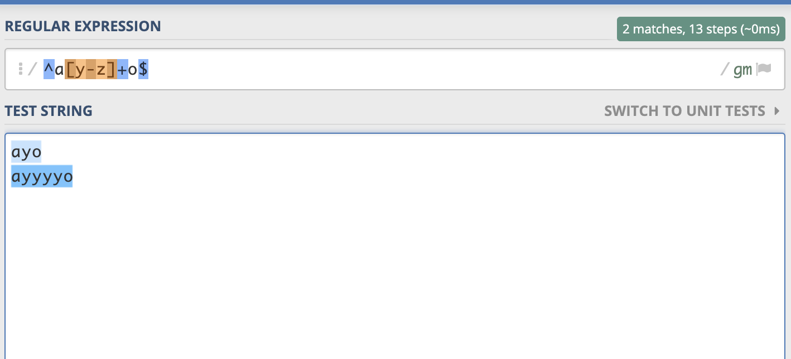

특정 문자와 일치를 나타내는 것이 아니라, 일치하는 것의 위치 정보를 나타내는 표현식

`^`: 문자열의 시작 부분에서 일치해야 한다는 뜻

`$`: 문자열의 끝 부분에서 일치해야 한다는 뜻

/^a[y-z]+o\$/ 를 정규포현식으로 입력하면 a로 시작하고 y-z가 사이에 있고 o로 끝나는 문자열과 매치가 된다.

이 때 주의해야 할점은 멀티라인모드 m을 넣어 주지 않으면 위의 그림의 문자열은 매치가 되지 않는다는 것이다. 왜냐하면 멀티라인 모드가 아니면 전체를 시작과 끝으로 보고 정규표현식이 적용되기 때문이다.
