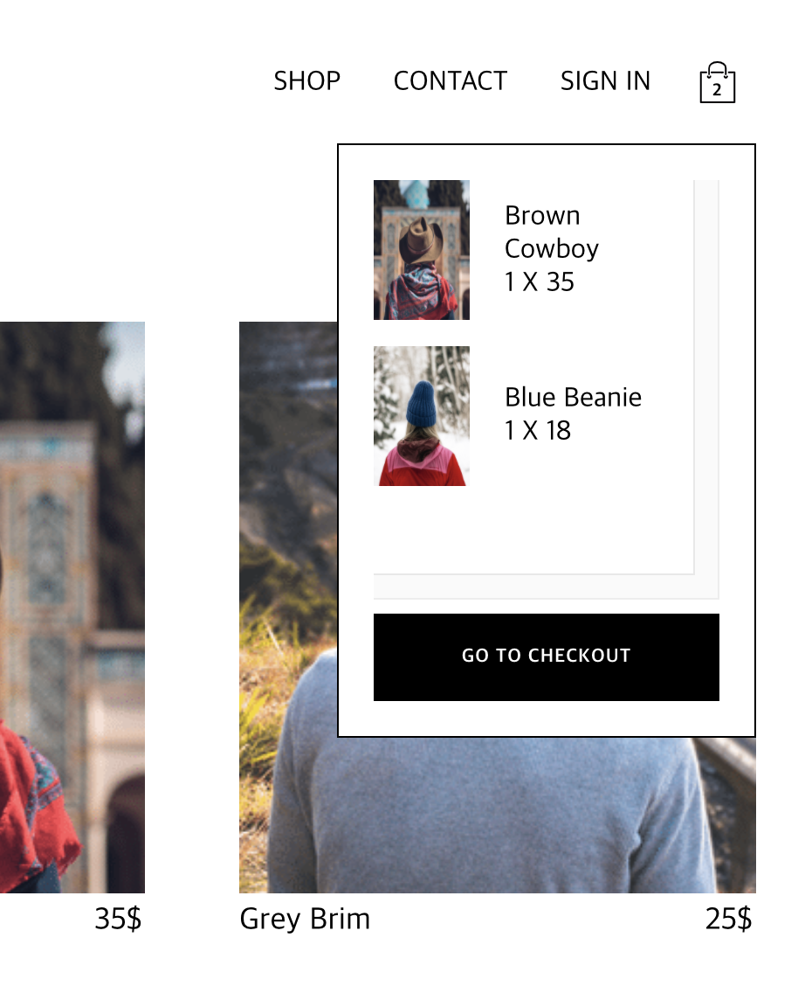
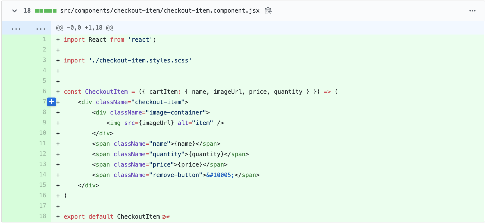
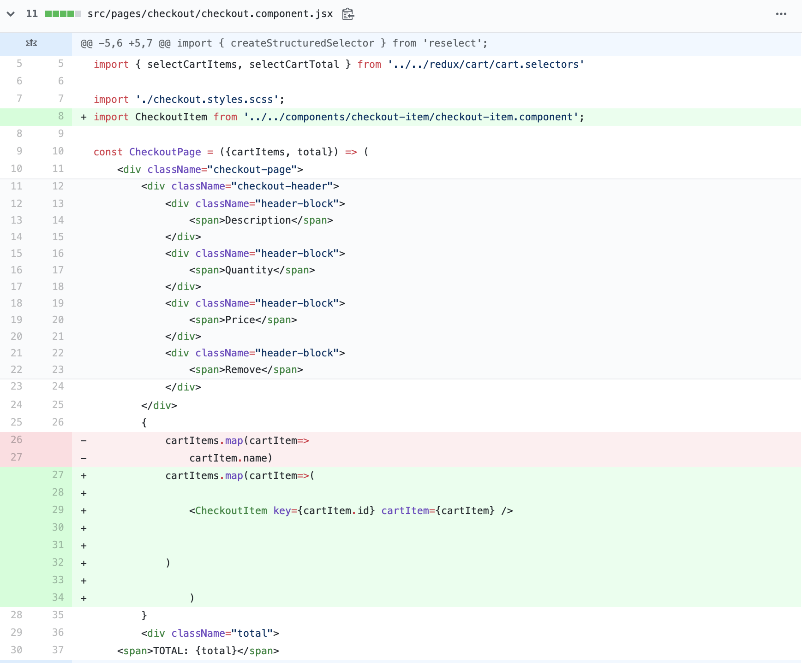

[커밋로그](https://github.com/Jesscha/react-shoppingmall/commit/d32a9b2631429a8e75393c5a2418d1afb7a3a74b)

오늘 리액트 쇼핑몰의 카트에 담겨 있는 아이템을 결제 페이지로 넘기는 작업을 했다. 

이렇게 카트에 담긴 상품을

이렇게 결제 페이지에 띄우는 것이다. 

작성 코드

리액트 개발을 할때 제일 먼저 해야 하는 것은 컴포넌트 단위로 생각을 하는 것이다. 

여기에 있는 아이템 하나 하나의 데이터를 받아서 양식에 맞게 보여 주는 checkout-item 이라는 컴포넌트를 만들었다.

이 컴포넌트는 상위 컴포넌트에서 cartItem 이라는 props를 받아서 화면상에 띄워 준다. 

여기서 한가지 짚고 넘어가고 싶은 것은 이미지를 넣을 때, image-container 않에 이미지를 넣어야 패딩, 마진 등 관리가 더 쉽다는 점이다

상위 컴포넌트는 CheckoutPage인데 아래처럼 수정해 주었다. 

CheckoutPage는 리덕스로 부터 cartItems를 받아 checkoutItem 컴포넌트에 위처럼 넣어주면 된다. 

