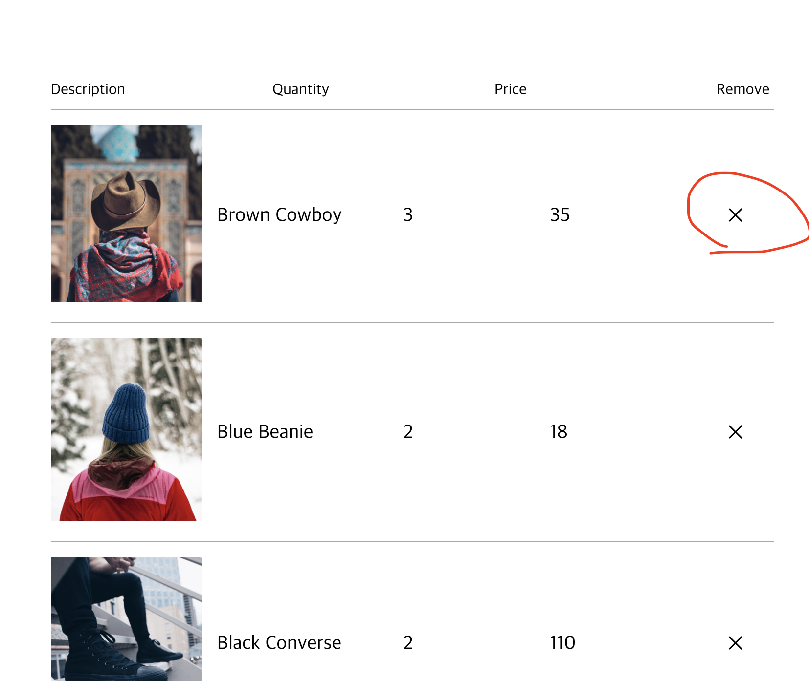
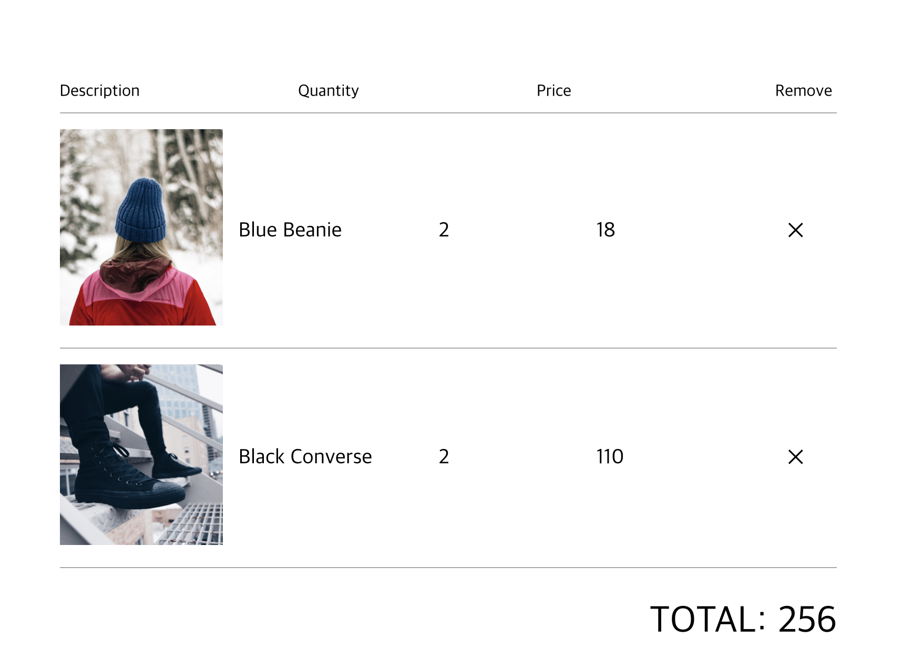
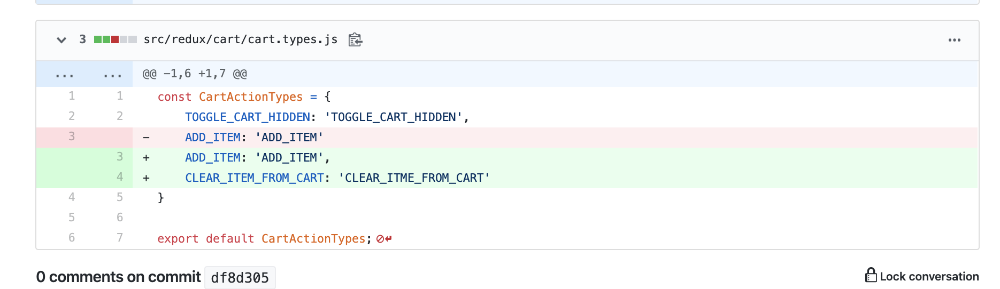
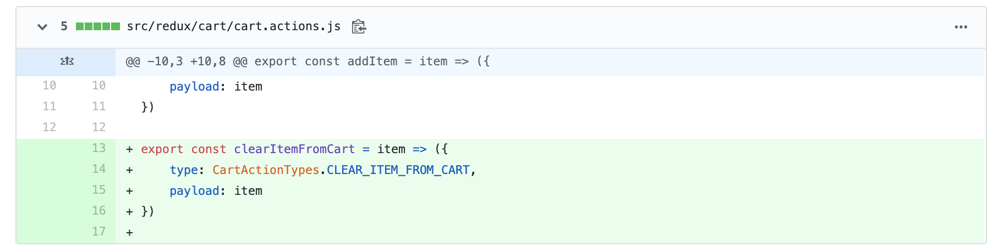
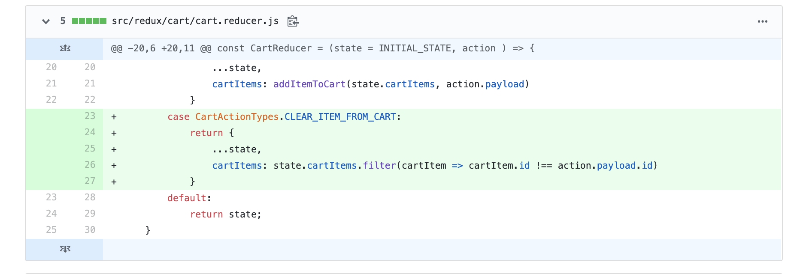
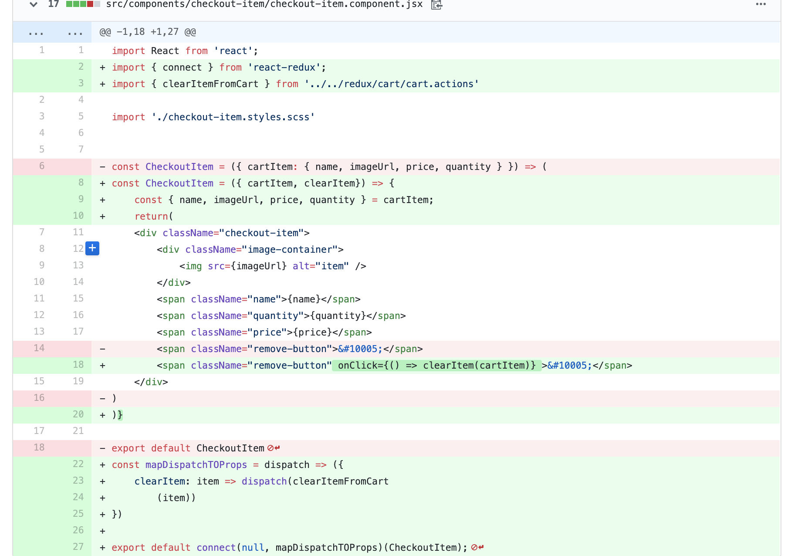

[커밋로그](https://github.com/Jesscha/react-shoppingmall/commit/df8d3053e298111b870483a29cac18b233f46a45)

오늘의 작업은 결제 페이지에서 x 버튼을 누르면 아이템을 뺄 수 있도록 하는 기능을 추가하는 것이다. 

이 기능이 구현되도록 하기 위해서는 x 버튼을 눌렀을 때 cartItems state가 변하도록 만들어야 한다.

CheckoutPage 컴포넌트는 cartItems state를 각각 cartItem에 흘려 보내어 각 컴포넌트를 만든다. 이때 흘려 넣어지는 cartItems state를 x버튼을 누르면 조작할 수 있도록 만드는 것이 오늘의 목표다. 

제일 먼저 해야 하는 것은 `src/redux/cart/cart.types.js`에 가서 해당 액션의 타입을 지정해 주는 것이다. 우리는 여기서 카트에서 지워지는 행위의 타입을 'CLEAR_ITME_FROM_CART'라고 명명 한다 

이제 실제 우리가 사용할 메서드를 만들어 준다. `src/redux/cart/cart.actions.js`에 메서드를 추가한다. 

이 매서드의 액션 타입을 앞에 타입 모듈에서 정의한 CLEAR_ITME_FROM_CART로 놓는다. 그리고 payload에는 아이템을 넣어서 전달한다. 

이렇게 만들어진 메서드는 리듀서로 payload에 담겨진 아이템을 전달한다. 리듀셔는 타입을 기준으로 액션을 분류하기 때문에 CLEAR_ITME_FROM_CART인 케이스를 하나 새로 만든다. 

그리고 CLEAR_ITME_FROM_CART타입으로 들어온 payload의 id와 일치 하지 않는 것들만 cartItems state로 살려 놓는다. 이렇게하면 clearItemFromCart 메서드로 넘어간 아이템만 제거 되는 효과가 있다. 

마지막으로 cartItem 컴포넌트에 새로 만든 액션을 추가해 주면 된다. redux에서 state를 바꾸는 기능을 할 것이니까 mapDiapatchToProps를 만들어서 connect의 두번째 인자로 넘겨 준다. 

mapDispatchToProps는 clearItem이라는 state(이자 메서드)를 컴포넌트 내에서 사용할수 있게 해 주는데, 이 메서드는 clearItemFromCart에 Item을 넘겨주는 역할을 한다. 

아래와 같이 구현하면 끝~~
