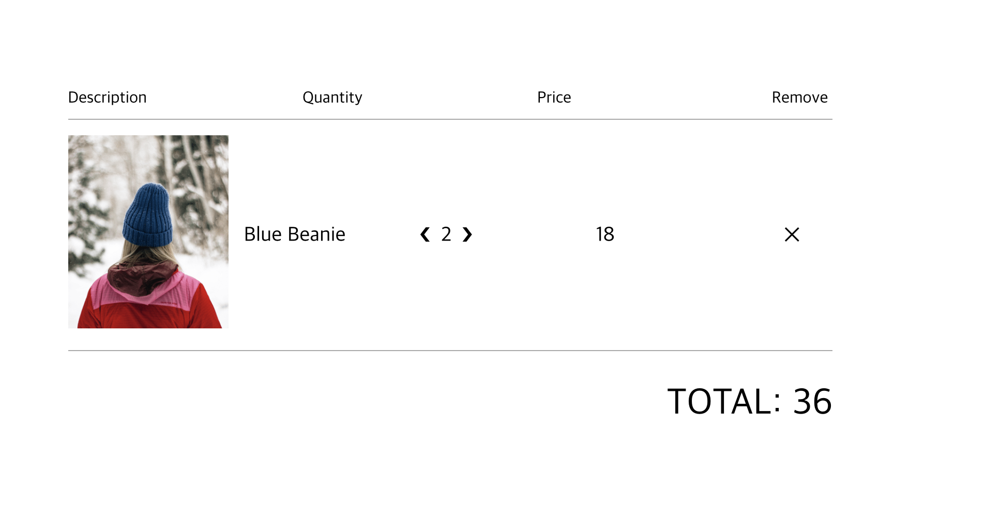

[커밋로그](https://github.com/Jesscha/react-shoppingmall/commit/6ffa8417473a42bcee01c2fe9b36af94a0de079f)


오늘 추가한 기능은 checkoutPage에서 구매하고자 하는 물품의 수량을 늘리고 줄일 수 있도록 하는 것이다.


제일 먼저 해야 하는 작업은 checkoutItem 컴포넌트에 수량 추가, 감소 버튼을 추가하는 것이다. &#10094와  &#10095는 특수기호를 표시하는 문자다. 이 문자는 각 각 <,와 >를 나타낸다. 이제 여기에 들아가는 removeItem과 addItem을 만들기 위해 필요한 것들에 대해서 살펴보자

```javascript
<span className="quantity">
    <div className="arrow" onClick = {()=> removeItem(cartItem)}>&#10094;</div>
    <span className="value">{quantity}</span>
    <div className="arrow" onClick = {()=> addItem(cartItem)}>&#10095;</div>
</span>
```

제일 먼저 해야 하는 것은 해당 하는 액션의 타입을 지정해 주는 것이다. 그래야 리덕스가 해당 변화를 읽을 수 있다. ADD_ITEM은 카트에 담을때도 사용했던 액션이니, 이번에는 RemoveItem만을 새롭게 만든다. 

```javascript
const CartActionTypes = {
    TOGGLE_CART_HIDDEN: 'TOGGLE_CART_HIDDEN',
    ADD_ITEM: 'ADD_ITEM',
    REMOVE_ITEM: 'REMOVE_ITEM',
    CLEAR_ITEM_FROM_CART: 'CLEAR_ITME_FROM_CART'
}
```

REMOVE_ITEM 이라는 액션 타입을 추가한다. 

그리고 액션에 해당 타입을 가지는 메서드를 추가해 준다. 

```javascript
export const removeItem = item => ({
    type: CartActionTypes.REMOVE_ITEM,
    payload: item
})
```

이제 리듀서에 해당 액션이 오면 어떤 상태변화를 일으킬 것인지 정의한다.

```javascript
case CartActionTypes.REMOVE_ITEM:
            return {
                ...state,
                cartItems: removeItemFromCart(state.cartItems, action.payload)
            }
```

결제 페이지에서 숫자를 줄이기 위해서는 0이하로 가면 아예 삭제를 해야 하고, 0보타 클때는 숫자를 하나씩 줄이는 기능이 필요하다. 이를 위해서 하나의 새로운 유틸리티를 만들어 준다. 이 유틸리티의 이름이 `removeItemFromCart`이다. 이게 오늘의 핵심이다.
```javascript

export const removeItemFromCart = (cartItems, cartItemToRemove) => {
  const existingCartItem = cartItems.find(
    cartItem => cartItem.id === cartItemToRemove.id
  )

  if (existingCartItem.quantity ===1) {
    return cartItems.filter(cartItem => cartItem.id !== cartItemToRemove.id)
  }

  return cartItems.map(
    cartItem =>
    cartItem.id === cartItemToRemove.id ?
    { ...cartItem, quantity: cartItem.quantity -1}
    : cartItem
  );
} 
```
`removeItemFromCart`는 기존의 카트 아이템과 숫자를 줄일 카트 아이템을 인자로 받는다. 

`existingCartItem`는 카트 아이템중에 선택된 카트 아이템이 된다. find를 통해 id가 매치되는 아이템을 찾는다. 

해당 아이템의 수량이 1개라면, 여기서 한번 더빼면 아예 카트 아이템에서 사라져야 한다. 따라서 해당 id를 가진 아이템을 filter를 통해 걸러낸 cartItems를 새로운 state로 지정한다.

만약 수량이 1개가 아니라면, cartItems에서 다른건다 그대로 두고 id가 일치하는것의 quantity만 하나를 빼 준 배열을 cartItem으로 정한다. 


이렇게 만들어진 함수를 mapDispatchProps에 넣고 connect로 넘겨준 뒤 onClick에 해당 매서드와 아이템을 지정해 주면 된다. 

```javascript
const mapDispatchTOProps = dispatch => ({
    clearItem: item => dispatch(clearItemFromCart(item)),
    addItem: item => dispatch(addItem(item)),
    removeItem: item => dispatch(removeItem(item))
})

export default connect(null, mapDispatchTOProps)(CheckoutItem); 
```

기능 구현 화면


