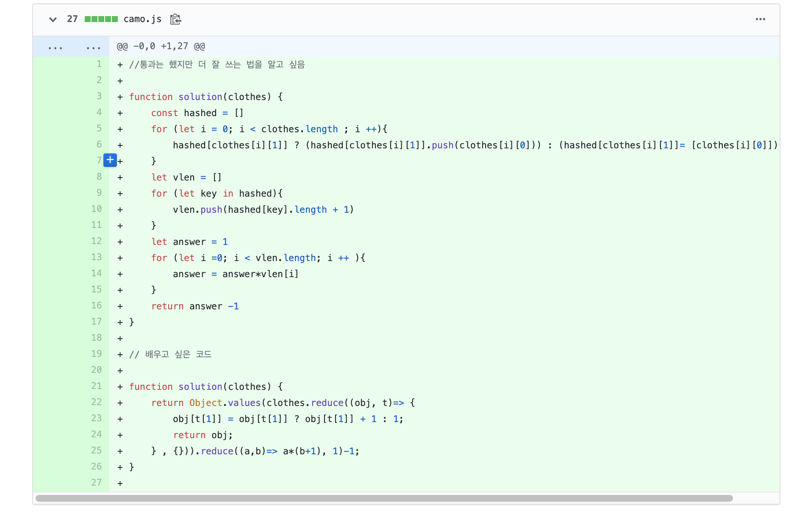

[출처](https://programmers.co.kr/learn/courses/30/lessons/42578)

[커밋로그](https://github.com/Jesscha/algorithmsolutions/commit/9a3d469c09570979881840f8bb03b982b5da2a0c)




해시맵으로 풀어서 맞았지만, 다른사람이 reduce를 사용해서 나보다 훨씬간단히 푼 풀이를 발견해서 공부해 본다. 

```javascript
function solution(clothes) {
    return Object.values(clothes.reduce((obj, t)=> {
        obj[t[1]] = obj[t[1]] ? obj[t[1]] + 1 : 1;
        return obj;
    } , {})).reduce((a,b)=> a*(b+1), 1)-1;    
}
```
`Object.values()`는 뒤에 들어온 객체의 속성의 값들로 이루어진 배열을 리턴 한다. 
즉, `clothes.reduce((obj, t)=> { obj[t[1]] = obj[t[1]] ? obj[t[1]] + 1 : 1; return obj;} , {})`  의 결과로 나온 배열에 reduce를 사용하여 답을 도출 한 것이다. 

reduce를 할 배열을 만드는 코드에도 reduce가 사용되고 있는데, object의 key가 있으면 1을 더하고 있으면 1을 만드는 식이다. 어차피 숫자가 중요한 것이기 때문에 각 부위별 숫자를 key로 분류하여 객체에 담는 것이다. 

이 key & value paire 가 Object.valuse()의 인자로 들어갔으니 나오는 출력은 각 key의 value들이 된다. 이를 reduce를 써서 다 곱해주고 아무것도 안 입는 경우 1개를 빼주면 정답이 된다.


