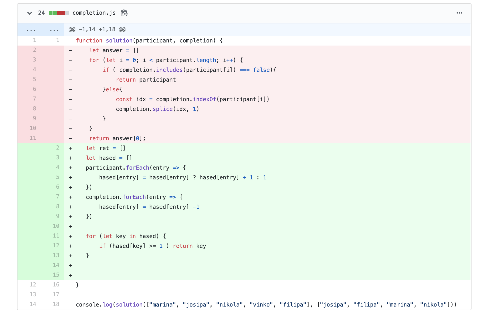

[출처](https://programmers.co.kr/learn/courses/30/lessons/42576?language=javascript)

[커밋로그](https://github.com/Jesscha/algorithmsolutions/commit/edd38ce4d2f754840ea579ed71762b23c8722d14)

자바스크립트로 알고리즘을 푸는 연습 중이다. 

맨 처음에는 그냥 배열에 for 문을 돌려서 풀려고 했으나, 시간초과로 실패 했다. 

내가 맨 처음 짠 알고리즘은, for문과 include 를 같이 쓰고 있어 O(n^2)의 시간 복잡도를 가진다.

새롭게 시도한 식에서는 해시맵을 사용했다. 배열로 주어진 participant를 해시맵으로 다시 만들었다. 

그뒤 completion의 원소들을 키로 활용하여 해당 키에 해당하는 값을 1씩 줄여 준다.

마지막으로 key의 값이 1보다 큰게 있다면 그 값을 리턴하면 된다. 

for문이나 forEach를 계속 쓰기는 했지만, 각 반복문이 끝나고 새로운 반복문을 호출하기 때문에 O(n)의 시간 복잡도로 풀수 있다.
