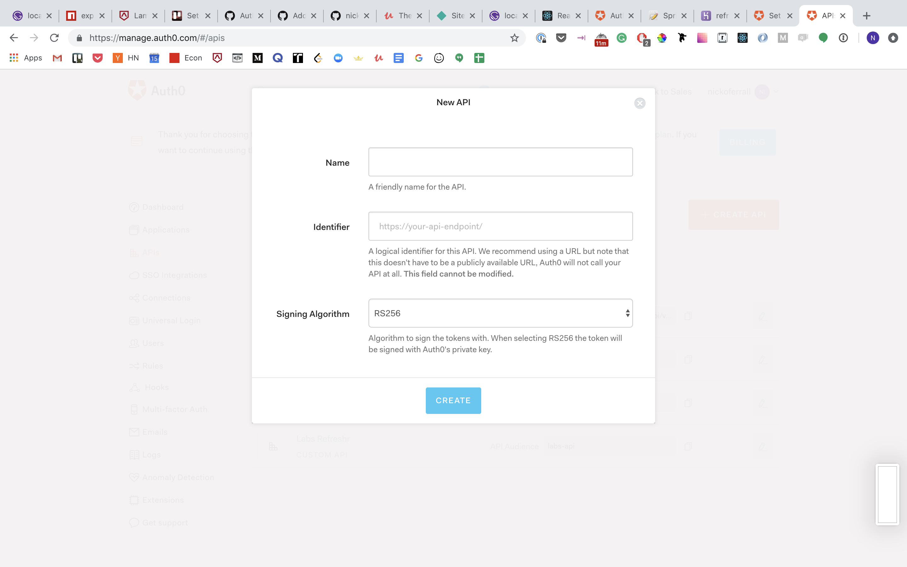
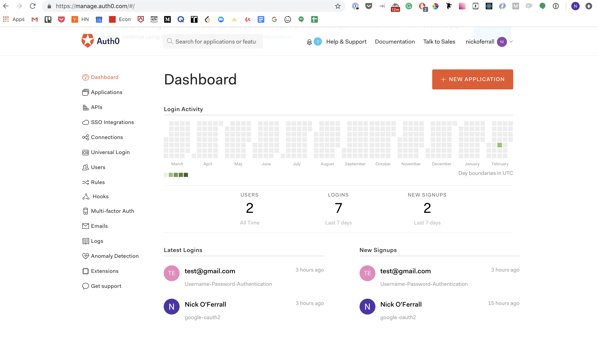
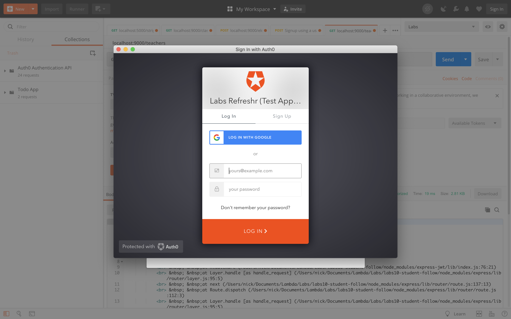

### Accomplishments this week

This week our team planned what we will do for the 5 weeks, we divided tasks into trello cards and we exceeded expectations for the code written this week.

We successfully created APIs and rendered 500 fake seed data users. The front end was able to connect to the database and render the users.

We have also created multiple helper functions, integrate Material UI, refactored the codebase using React Hooks, built migrations, routes as well as authenticating the app with Auth0.
I personally focused on the backend this week. I created routes, deployed to Heroku and added authentication with Auth0.

## Tasks Pulled

- Task: Set-up Repo, decide what tasks we should work on, add to trello and decide on branching in a single repo vs an organisational repo
- Trello: https://trello.com/c/isOsIZyn/7-github-repo
- Github: https://github.com/Lambda-School-Labs/labs10-student-follow/commit/0938437565ca16c302bd37a9b9513f647a6fdca0

---

- Task: Add get requests for teachers
- https://trello.com/c/iaGnXvX5/41-get-request-for-teachers
- Github: https://github.com/Lambda-School-Labs/labs10-student-follow/pull/2

---

- Task: Deploy postgres to Heroku
- https://trello.com/c/geA2e9xN/45-connect-postgres-db-to-codebase
- Github: https://github.com/Lambda-School-Labs/labs10-student-follow/pull/15

---

- Task: Add get and post requests for routes
- https://trello.com/c/oTB2UG5n/42-add-get-and-post-requests-for-expected-tables
- Github: https://github.com/Lambda-School-Labs/labs10-student-follow/pull/12

---

- Task: Add auth0 functionality
- https://trello.com/c/QaITvKp2/47-set-up-login-with-auth0
- Github: https://github.com/Lambda-School-Labs/labs10-student-follow/pull/23

---

#### Detailed Analysis on Auth0 Functionality

Auth0 is a secure, third party authentication solution. Rather than handling authentication ourselves and hashing passwords, we felt that it would be more secure to integrate Auth0. To begin the integration, I signed up for an Auth0 account and created an API for Refreshr, as pictured below.

Other than offering additional security, Auth0 offers clear documentation and a user friendly dashboard that displays the numbers of users our API has.

Once the API was set-up, I added authentication middleware to our backend codebase. I used expressjwt library and jwks-rsa to verify the token and the length of time the authentication will be valid for.

I added the authentication middleware to the routes and tested the routes using Postman. With Postman, we can create environments with information about the API. We can then insert that information using fields provided by Postman, as pictured below.

After submitting a GET request to a protected route, the user is redirected to the Auth0, pictured below. They can then login using Gmail, email or social accounts. A token is then provided which enables access to the routes.

