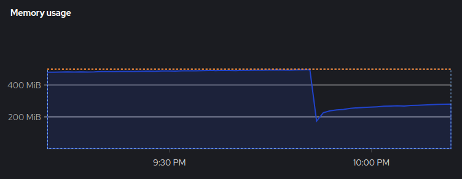
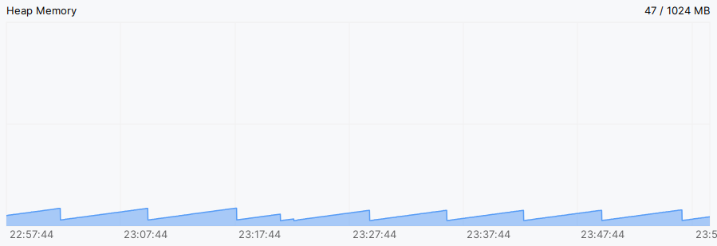

In recent weeks, I tried to import a library maintained by another team, which aims to establish a connection between the server and the client using a customized protocol. However, after completing the implementation and deployment, a serious memory leak occurred. 



Though I have experience with performance and memory leak profiling, the world of Java is entirely foreign to me. So, here are some quick insights to Java application profiling. 

## Is there a Leak?

I firmly believe that it's a good practice to monitor CPU and memory usage periodically after every deployment. Typically, with proper observability practices, you can detect memory leaks in a timely manner.

Apart from checking the overall memory usage, you can use tools like the IntelliJ Profiler and JDK tools for more detailed profiling. Let's consider the IntelliJ Profiler as an example. If you follow the official profiling tutorial, [CPU and memory live charts | IntelliJ IDEA Documentation](https://www.jetbrains.com/help/idea/cpu-and-memory-live-charts.html), you'll come across the Heap Memory chart. This chart can indicate if there's a leak in the heap memory. 



If you observe a saw-tooth pattern in the heap memory layout as above, it indicates that the Garbage Collector (GC) is functioning properly and there isn't a heap memory leak. Conversely, if the chart shows a consistently increasing trend, it suggests a heap memory leak. 

## Get Closer: Check the Log

Just like analyzing any other kind of problem, we identify the issue and gradually narrow down the potential culprits. Java excels in error handling and provides a call stack for debugging. There are several types of Out of Memory Error (OOM). The most common one is `java.lang.OutOfMemoryError: Java heap space`. This error indicates that you've run out of heap space, which may be due to insufficient allocated heap space or improper implementation. 

In this case, I encountered the error `java.lang.OutOfMemoryError: unable to create native thread: possibly out of memory or process/resource limits reached`. This indicates that the JVM failed to create a new thread due to two possilble reasons. However, it's not possible to reproduce the issue on my local machine, so it's essential for me to profile the leak online. 

## JDK Tools: Basic Info

Firstly, `jps` lists all the JVM processes, and `pinger-service.jar` is the specific service suspected of having a leak issue:

```bash
$ jps
7 pinger-service.jar
250 Jps
```

With the specified pid, you can inspect VM flags using `jinfo`:

```bash
$ jinfo -flags 7
VM Flags:
-XX:AdaptiveSizePolicyWeight=90 -XX:CICompilerCount=2 -XX:GCTimeRatio=4 -XX:InitialHeapSize=8388608 -XX:MaxHeapFreeRatio=10 -XX:MaxHeapSize=132120576 -XX:MaxNewSize=44040192 -XX:MinHeapDeltaBytes=524288 -XX:MinHeapFreeRatio=5 -XX:MinHeapSize=8388608 -XX:NewSize=2621440 -XX:NonNMethodCodeHeapSize=5826188 -XX:NonProfiledCodeHeapSize=122916026 -XX:OldSize=5767168 -XX:ProfiledCodeHeapSize=122916026 -XX:ReservedCodeCacheSize=251658240 -XX:+SegmentedCodeCache -XX:SoftMaxHeapSize=132120576 -XX:+UnlockExperimentalVMOptions -XX:+UseCompressedClassPointers -XX:+UseCompressedOops -XX:+UseContainerSupport -XX:+UseParallelGC 
```

If you're familiar with the workings of GC,, `jstat` is for you: 

```bash
$ jstat -gcutil 7
  S0     S1     E      O      M     CCS    YGC     YGCT     FGC    FGCT     CGC    CGCT       GCT   
  0.00   0.00  57.86  89.89  99.37  97.00    288     0.974   121    10.745     -         -    11.718
```

While the aforementioned tools provide valuable insights for reviewing configurations and details about GC, you can delve deeper with other tools.

## JDK Tools: Heap and Thread

Finally, we come to the main course. Before this step, the leak issue might have seemed like a black box to you. In this phase, you would expect to find some suspected culprits. Alright, let's start with `jmap`. 

`jmap` could list the histogram of the live object heap: 

```bash
$ jmap -histo 7
num     #instances         #bytes  class name (module)
-------------------------------------------------------
   1:        163293       20076592  [B (java.base@17.0.2)
   2:         34197        9135920  [Ljava.lang.Object; (java.base@17.0.2)
   3:         28496        3313352  [I (java.base@17.0.2)
   4:        104208        2500992  java.lang.String (java.base@17.0.2)
   5:           500        1925184  [Ljava.nio.channels.SelectionKey; (java.base@17.0.2)
   6:          2800        1881600  io.netty.util.internal.shaded.org.jctools.queues.MpscArrayQueue
   7:         50171        1605472  java.util.concurrent.ConcurrentHashMap$Node (java.base@17.0.2)
   8:         13329        1579848  java.lang.Class (java.base@17.0.2)
   9:          2422        1273608  [C (java.base@17.0.2)
  10:         12858         984904  [Ljava.util.HashMap$Node; (java.base@17.0.2)
  11:          9187         808456  java.lang.reflect.Method (java.base@17.0.2)
  12:         22245         711840  java.util.HashMap$Node (java.base@17.0.2)
  13:          4752         657552  [J (java.base@17.0.2)
  14:         14631         585240  java.util.LinkedHashMap$Entry (java.base@17.0.2)
  15:           944         543744  io.netty.util.internal.shaded.org.jctools.queues.MpscUnboundedArrayQueue
  16:         15431         541640  [Ljava.lang.String; (java.base@17.0.2)
  17:          8897         498232  java.util.LinkedHashMap (java.base@17.0.2)
  18:          1081         478352  [Ljava.util.concurrent.ConcurrentHashMap$Node; (java.base@17.0.2)
...
```

Also, it could be used to dump the current heap memory (Memory Snapshot); however, the dump file needs to be analyzed with other tools, such as `jhat` or `Eclipse Memory Analyzer Tool (MAT)`: 

```bash
$ jmap -dump:file=/tmp/DumpFile.txt 7
Dumping heap to /tmp/DumpFile.txt ...
Heap dump file created [94775465 bytes in 0.337 secs]
```

Since the issue might be related to thread problems, we also need to check the stack traces of threads using `jstack`: 

```bash
$ jstack -l 7
2023-10-29 01:04:26
Full thread dump OpenJDK 64-Bit Server VM (17.0.2+8-86 mixed mode, sharing):

Threads class SMR info:
_java_thread_list=0x00007f7070002140, length=660, elements={
0x00007f709c0a1580, 0x00007f709c0a2990, 0x00007f709c0aa570, 0x00007f709c0ab8f0,
0x00007f709c0accd0, 0x00007f709c0ae650, 0x00007f709c0afb50, 0x00007f709c0b0f90,
0x00007f709c0fd390, 0x00007f709c100220, 0x00007f709c844d50, 0x00007f7048088cf0,
...
"client-5075-1" #6519 prio=5 os_prio=0 cpu=0.63ms elapsed=4.62s tid=0x00007f6ff4143d10 nid=0x1ae3 runnable  [0x00007f6e5fc14000]
   java.lang.Thread.State: RUNNABLE
 at sun.nio.ch.EPoll.wait(java.base@17.0.2/Native Method)
 at sun.nio.ch.EPollSelectorImpl.doSelect(java.base@17.0.2/EPollSelectorImpl.java:118)
 at sun.nio.ch.SelectorImpl.lockAndDoSelect(java.base@17.0.2/SelectorImpl.java:129)
 - locked <0x00000000fe2c2c30> (a io.netty.channel.nio.SelectedSelectionKeySet)
 - locked <0x00000000fe2c29b0> (a sun.nio.ch.EPollSelectorImpl)
 at sun.nio.ch.SelectorImpl.select(java.base@17.0.2/SelectorImpl.java:146)
 at io.netty.channel.nio.SelectedSelectionKeySetSelector.select(SelectedSelectionKeySetSelector.java:68)
 at io.netty.channel.nio.NioEventLoop.select(NioEventLoop.java:879)
 at io.netty.channel.nio.NioEventLoop.run(NioEventLoop.java:526)
 at io.netty.util.concurrent.SingleThreadEventExecutor$4.run(SingleThreadEventExecutor.java:997)
 at io.netty.util.internal.ThreadExecutorMap$2.run(ThreadExecutorMap.java:74)
 at io.netty.util.concurrent.FastThreadLocalRunnable.run(FastThreadLocalRunnable.java:30)
 at java.lang.Thread.run(java.base@17.0.2/Thread.java:833)

   Locked ownable synchronizers:
 - None

"VM Thread" os_prio=0 cpu=8927.59ms elapsed=4637.75s tid=0x00007f709c09cd90 nid=0xa runnable  

"GC Thread#0" os_prio=0 cpu=28683.38ms elapsed=4637.76s tid=0x00007f709c03afe0 nid=0x9 runnable  

"VM Periodic Task Thread" os_prio=0 cpu=2280.39ms elapsed=4637.72s tid=0x00007f709c0fecb0 nid=0x14 waiting on condition  

JNI global refs: 26, weak refs: 4
```

Upon seeing these messages, I noticed that there seem to be too many runnable threads that are not being released: 

```bash
$ jstack -l 7 | grep client
"client-4-1" #40 prio=5 os_prio=0 cpu=8.82ms elapsed=5109.72s tid=0x00007f7010028a10 nid=0x2f runnable  [0x00007f6ff3dfc000]
"client-15-1" #52 prio=5 os_prio=0 cpu=2.80ms elapsed=5104.13s tid=0x00007f7004009080 nid=0x3b runnable  [0x00007f6ff2af5000]
"client-22-1" #61 prio=5 os_prio=0 cpu=2.61ms elapsed=5098.99s tid=0x00007f6ff4002740 nid=0x44 runnable  [0x00007f6ff30fb000]
"client-42-1" #85 prio=5 os_prio=0 cpu=2.51ms elapsed=5093.44s tid=0x00007f6ff40047c0 nid=0x5c runnable  [0x00007f6ff1ee9000]
"client-51-1" #96 prio=5 os_prio=0 cpu=2.34ms elapsed=5088.16s tid=0x00007f700c0053c0 nid=0x67 runnable  [0x00007f6ff26f1000]
...
"client-5629-1" #7231 prio=5 os_prio=0 cpu=0.86ms elapsed=5.25s tid=0x00007f6ff4050290 nid=0x1dfa runnable  [0x00007f6e5afc8000]
"client-5630-1" #7234 prio=5 os_prio=0 cpu=4.83ms elapsed=0.24s tid=0x00007f6ff405b0f0 nid=0x1dfd waiting on condition  [0x00007f6e5aec7000]
"client-5631-1" #7235 prio=5 os_prio=0 cpu=4.24ms elapsed=0.24s tid=0x00007f7004137830 nid=0x1dfe waiting on condition  [0x00007f6e5f40c000]
"client-5632-1" #7236 prio=5 os_prio=0 cpu=4.24ms elapsed=0.23s tid=0x00007f7018177c10 nid=0x1dff waiting on condition  [0x00007f6e5cae3000]
"client-5633-1" #7237 prio=5 os_prio=0 cpu=0.23ms elapsed=0.18s tid=0x00007f701017e7e0 nid=0x1e0d runnable  [0x00007f6e5b1ca000]

$ jstack -l 7 | grep client | wc -l
685
```

Therefore, it's now clear that too many unreleased threads are causing the leak. To fix it, I tracked the call stack based on the thread name in the log and found some unhandled errors. These errors are the reason threads aren't being released. 

## Conclusion

It's very frustrating when a memory leak occurs, and you spend a lot of time on it without seeing any productive results. Nonetheless, taking advantage of various profiling tools can greatly alleviate your stress. Remember this: no matter the issue, it definitely exists. As long as you use the right approaches and leverage the right tools, you're on the path to success.  

## References

* [Understanding Memory Leaks in Java | Baeldung](https://www.baeldung.com/java-memory-leaks)
* [What Causes java.lang.OutOfMemoryError: unable to create new native thread | Baeldung](https://www.baeldung.com/java-outofmemoryerror-unable-to-create-new-native-thread)
* [How to Detect Java Memory Leaks | Toptal®](https://www.toptal.com/java/hunting-memory-leaks-in-java)
* [How to solve java.lang.OutOfMemoryError: unable to create new native thread - Mastertheboss](https://www.mastertheboss.com/jbossas/monitoring/how-to-solve-javalangoutofmemoryerror-unable-to-create-new-native-thread/)
* [How to inspect a Thread Dump like a pro - Mastertheboss](https://www.mastertheboss.com/java/how-to-inspect-a-thread-dump-like-a-pro/)
* [Configuring cluster memory to meet container memory and risk requirements - Working with clusters | Nodes | OpenShift Container Platform 4.12](https://docs.openshift.com/container-platform/4.12/nodes/clusters/nodes-cluster-resource-configure.html)
* [How to solve java.lang.OutOfMemoryError: unable to create new native thread - Mastertheboss](https://www.mastertheboss.com/jbossas/monitoring/how-to-solve-javalangoutofmemoryerror-unable-to-create-new-native-thread/)
* [Introduction to profiling | IntelliJ IDEA Documentation](https://www.jetbrains.com/help/idea/profiler-intro.html)